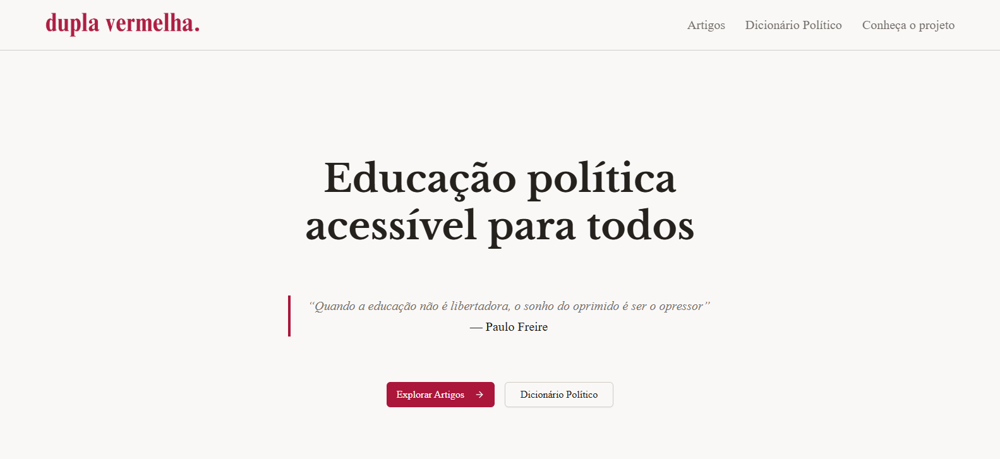
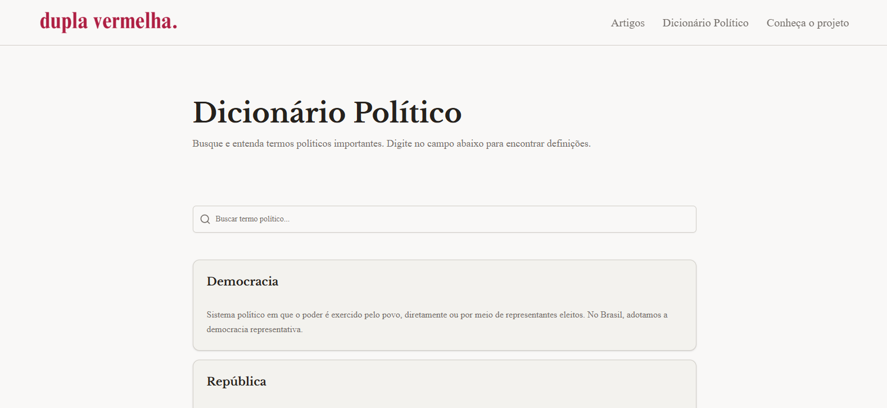
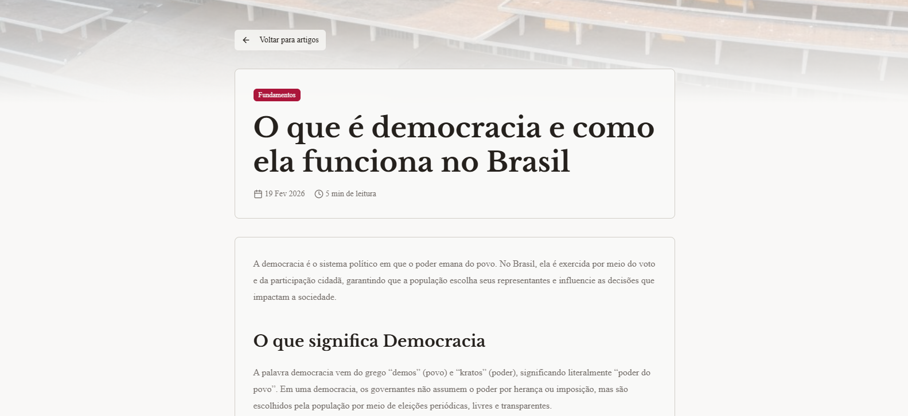

# 🔴 Dupla Vermelha

## 🌐 Sobre o Projeto

Este é o site institucional do **Dupla Vermelha**, um projeto de educação política acessível, criado com foco em:

- 📚 Produção de artigos educativos  
- 📖 Dicionário político explicativo  
- 🧠 Combate à desinformação  
- 🌍 Democratização do conhecimento político  

O projeto foi desenvolvido sem fins lucrativos, priorizando a experiência do usuário pela minha agência Boêmia.smk.

---

## 🌐 Site Oficial

🔗 https://duplavermelha.com.br/  (em breve hospedado!)

---

## 📸 Preview Página Inicial

---

## 📖 Preview Dicionário Político

---

## 📰 Preview Artigos

---

## ⚙️ Tecnologias Utilizadas

- **Next.js** (App Router)
- **TypeScript**
- **Tailwind CSS**
- **Shadcn UI**

Arquitetura estruturada com foco em:

- ⚡ Performance
- 🔎 SEO
- 🧩 Componentização
- 📈 Escalabilidade
- 🧱 Organização modular

---

## 🚀 Como Rodar o Projeto Localmente

### 1️⃣ Clone o repositório

\`\`\`bash
git clone https://github.com/seu-usuario/dupla-vermelha.git
\`\`\`

### 2️⃣ Acesse a pasta do projeto

\`\`\`bash
cd dupla-vermelha
\`\`\`

### 3️⃣ Instale as dependências

\`\`\`bash
npm install
\`\`\`

### 4️⃣ Rode o projeto

\`\`\`bash
npm run dev
\`\`\`

O projeto estará disponível em:

\`\`\`
http://localhost:3000
\`\`\`

---

## 📌 Estrutura Principal

- `/artigos` → Conteúdos educativos  
- `/dicionario` → Glossário político  
- `/sobre` → Apresentação do projeto  

---

## 📬 Contato

Em caso de dúvidas, sugestões ou parcerias:

Email: desenvolvedorgabrielsilveira@gmail.com  
LinkedIn: https://www.linkedin.com/in/gabriel-silveira-67979b18a/  

**Desenvolvido por Boêmia.smk & Gabriel Silveira** 🚀